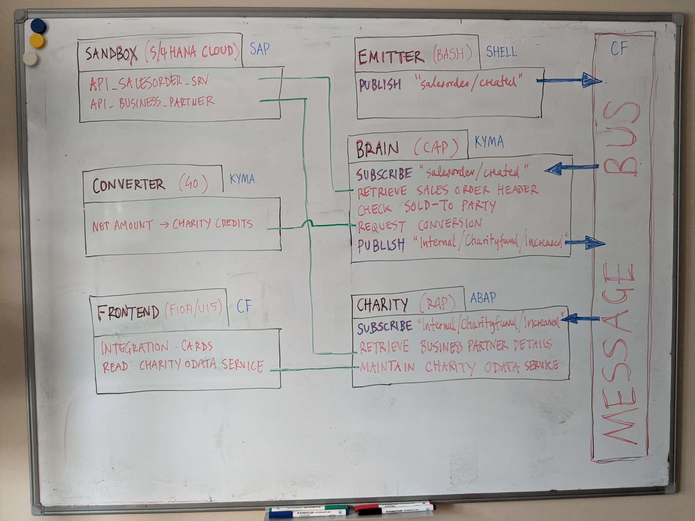
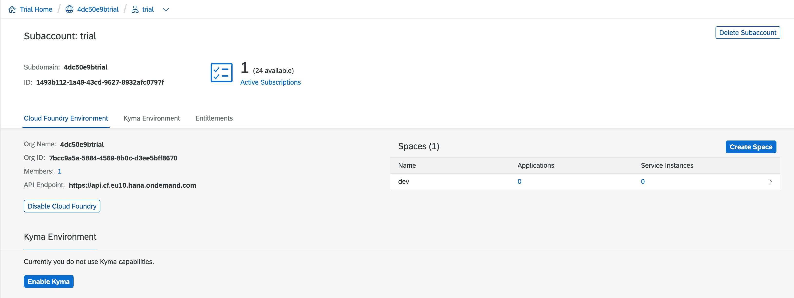

# SAP TechEd 2020 Developer Keynote

**Contents**

- [Overview](#overview)
- [Requirements](#requirements)
  - [A development environment](#a-development-environment)
  - [A GitHub account](#a-github-account)
  - [An SAP Cloud Platform trial account](#an-sap-cloud-platform-trial-account)
  - [Access to the SAP Business API Hub](#access-to-the-sap-business-api-hub)
  - [A message bus](#a-message-bus)
  - [Docker](#docker)
- [Download and installation](#download-and-installation)
- [Known issues](#known-issues)
- [How to obtain support](#how-to-obtain-support)
- [Contributing](#contributing)
- [License](#license)

## Overview

This is the repository containing all the source (code, configuration and more) that was put together by the SAP Developer Advocates team for the Developer Keynote (DK100) at SAP TechEd 2020.

If you're just looking for a guided set of steps, you may want to follow the [quick start](quickstart.md) guide (which is a work in progress for now).

The Developer Keynote session is designed to show how developers of different backgrounds, using different tools, technologies and languages can come together and contribute collectively towards an extension to an SAP S/4HANA Cloud system, using SAP Cloud Platform and services & runtimes upon it.

Watch the [Developer Keynote replay](https://events.sapteched.com/widget/sap/sapteched2020/Catalog/session/1603314875989001AsWU), and read more about the back story for this keynote in the blog post [SAP TechEd Developer Keynote DK100 - The Story](https://blogs.sap.com/2020/11/19/sap-teched-developer-keynote-dk100-the-story/).

The layout of this repository generally reflects the different components shown on the whiteboard diagram and demonstrated throughout the session.

You can study and experiment with each component individually, and they are of course all designed to work together as shown in the developer keynote itself. Each component has its own directory within this repository.

We recommend you take the components one at a time. Specific instructions are given for each component, in the respective README files. Here's a list of those components, with links to their directories (and the READMEs):

- [SANDBOX](s4hana/sandbox/) - the proxy app that sits in front of the SAP Business API Hub sandbox system and injects the API key into each request as it passes through (JavaScript app using the `@sap/approuter` package)

- [EMITTER](s4hana/event/) - the script that generates and emits (publishes) a "salesorder/created" event message to the message bus (Bash shell script invoking Messaging API calls to the SAP Enterprise Messaging service instance)

- [CONVERTER](kyma/) - the converter service that translates net amounts into charity credit amounts (Go language service listening for incoming HTTP requests)

- [BRAIN](cap/brain/) - the service that coordinates the event messages, subscribes to the "salesorder/created" topic, and publishes event messages to the "Internal/Charityfund/Increased" topic (a Node.js CAP based service connected to various endpoints)

- [FRONTEND](ui/) - the web dashboard that visualizes the data from the CHARITY component (an SAPUI5 / Fiori app using UI Integration Cards)

- [CHARITY](abap/) - the charity backend service that receives event messages published to the "Internal/Charityfund/Increased" topic, stores the data, retrieves business partner info, and makes an OData service available for the FRONTEND component (a Steampunk ABAP stack RAP based service)

If you're wondering about the MESSAGE BUS component, see the appropriate section a bit further down.

## Requirements

Component-specific requirements are to be found in the respective READMEs, but there are general requirements too which are listed here.

### A development environment

You'll need a development environment with tools that are detailed below and in the component-specific READMEs. We all have our own preferences, which is great, but if you want to follow along and can't decide, or are unsure of which direction to take, or are unable to install tools locally, we are building instructions to help you out, centred around the [SAP Business Application Studio](https://help.sap.com/viewer/product/SAP%20Business%20Application%20Studio/Cloud/en-US) (App Studio).

If you want to take that approach, make sure you read and follow the [App Studio setup instructions](usingappstudio.md).

### A GitHub account

You'll need your own GitHub account. Not only for the normal reasons of community and collaboration (you may want to send contributions to this repository via pull requests, for example) but also because some of the components are run in the Kyma environment on SAP Cloud Platform, and the individual component instructions (such as the ones for the [SANDBOX](s4hana/sandbox/)) will direct you to build Docker images and publish them to your own GitHub Packages container registry. See the [GitHub Packages Documentation](https://docs.github.com/en/free-pro-team@latest/packages) for more information.

You'll need your GitHub account when starting out - the [Download and Installation](#download-and-installation) section below will instruct you to fork this repository into your own space.

### An SAP Cloud Platform trial account

- Trial account: You'll need a trial account on SAP Cloud Platform, if you haven't got one already. Follow [this tutorial](https://developers.sap.com/tutorials/hcp-create-trial-account.html) for detailed instructions.

- Cloud Foundry (CF) environment: When you set up a trial account, a CF environment is set up automatically for you, with an organization and single 'dev' space.

  > The CF command line interface (CLI) is available as the `cf` command. The version of `cf` required for use in this repository context is version 6. There is a newer version 7 but there is [an issue with version 7 in the use of the `cf env` command](https://github.com/cloudfoundry/cli/issues/2116), which needs to work correctly here. Moreover, it's more likely than not that you have version 6 of `cf` already installed and available.

- Kyma environment: While a Kyma environment is not set up automatically, you can (and should) enable one with the "Enable Kyma" button on the main account overview page in the Cockpit, as shown in this screenshot. Follow [this tutorial](https://developers.sap.com/tutorials/cp-kyma-getting-started.html) for detailed instructions, and make sure you also install the k8s command line tool (`kubectl`) and download and set your "kubeconfig" appropriately, as explained in the [Install the Kubernetes Command Line Tool](https://developers.sap.com/tutorials/cp-kyma-download-cli.html) tutorial.

### Access to the SAP Business API Hub

- Access: Make sure you can log in to the [SAP Business API Hub](https://api.sap.com)

- API information: Check that you can access the API information (e.g. for the [Sales Order (A2X) API](https://api.sap.com/api/API_SALES_ORDER_SRV/resource))

- API specifications: Check also that you have the ability to download API specifications (e.g. to that same [API_SALES_ORDER_SRV API](https://api.sap.com/api/API_SALES_ORDER_SRV/overview))

- API key: Check that you have an API key available to you in your [preferences](https://api.sap.com/preferences), for access to the sandbox system

### A message bus

The one component on the whiteboard diagram that wasn't listed earlier is of course the MESSAGE BUS. This is an instance of the SAP Enterprise Messaging service. You'll need one of these. There is a 'dev' plan available for trial account users, it is marked as deprecated but perfectly serviceable for our needs.

> If you want to learn more about the SAP Enterprise Messaging service and everything you can do with the 'dev' plan, check out this series from the Hands-on SAP Dev show on the SAP Developers YouTube channel: [Diving into messaging on SAP Cloud Platform](https://www.youtube.com/playlist?list=PL6RpkC85SLQCf--P9o7DtfjEcucimapUf). Also, see the blog post [An overview of SAP Developers video content](https://blogs.sap.com/2020/11/09/an-overview-of-sap-developers-video-content/) for more information on SAP Developers video content in general.

Please set up an instance of the SAP Enterprise Messaging service according to [these instructions](messagebus/).

### Docker

If you want to try out the local Docker and Kyma runtime based aspects, you'll need Docker on your machine. Install it by following the [Get Docker](https://docs.docker.com/get-docker/) instructions for your platform.

## Download and installation

To use this repository, **fork it into your own user or org space on GitHub, and then clone that**. You can now follow the component instructions, as well as this main README.

For more information about forking in general, see [Fork a repo](https://docs.github.com/en/free-pro-team@latest/github/getting-started-with-github/fork-a-repo) in the GitHub documentation.

Throughout the instructions in this repository, the place where you forked this repository too will be referred to in the form "OWNER/REPOSITORY", and you should replace these placeholders with values that are appropriate for you. For example, if you are on GitHub as 'qmacro', and you fork this repository to that space, your values for "OWNER/REPOSITORY" would be "qmacro/teched2020-developer-keynote".

## Known issues

None at the time of writing.

## How to obtain support

Support for this repository is limited to the SAP TechEd 2020 Developer Keynote event and a limited number of weeks following that. Please raise an issue in this repository with as much detail as you can.

## Contributing

This is a community project and contributions will be welcome in the form of pull requests (PRs) - please submit in the normal way. Thank you!

## License

Copyright (c) 2020 SAP SE or an SAP affiliate company. All rights reserved. This project is licensed under the Apache Software License, version 2.0 except as noted otherwise in the [LICENSE](LICENSES/Apache-2.0.txt) file.
