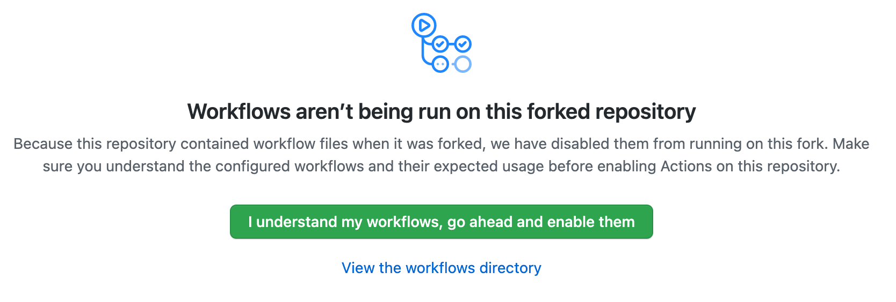

# Enabling workflows on GitHub

If you're using a development environment where you don't have Docker available locally (as is the case when [using the SAP Business Application Studio](usingappstudio.md)), then you can use a [GitHub Actions](https://github.com/features/actions) based workflow instead, in the context of your forked repository. 
This Developer Keynote repository contains such a workflow, defined in the [`image-build-and-publish.yml`](.github/workflows/image-build-and-publish.yml) file, and so when you fork the repository you get this workflow along with everything else.

However, for security reasons, GitHub initially _sets any existing workflows in a forked repository to a disabled state_, so before being able to use the workflow in your own forked repository, you'll see a message like this which will warn you and allow you to enable them:

Make sure you enable the workflows before proceeding.
