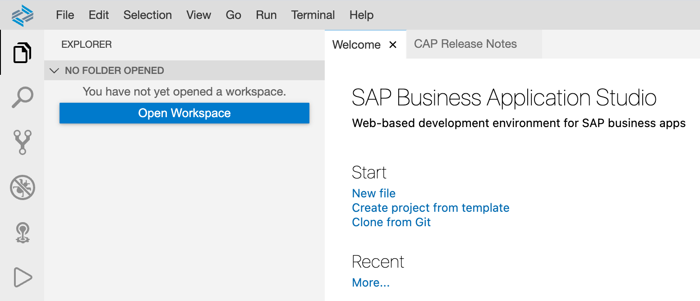

# Using the SAP Business Application Studio

**Contents**
- [Overview](#overview)
- [Perform initial setup](#perform-initial-setup)
- [Create a Dev Space](#create-a-dev-space)
- [Clone your fork of this repository](#clone-your-fork-of-this-repository)
- [Open up a terminal](#open-up-a-terminal)
- [Add tools to your Dev Space](#add-tools-to-your-dev-space)

## Overview

We don't want to dictate which tools or environments to use, but also don't want to leave you stranded if you can't decide or are unable to install tools locally.

The aim here is to make sure you can dig into and get your hands dirty with all of the components in this Developer Keynote repository using the SAP Business Application Studio (App Studio), if that's what you want to do.

The [App Studio](https://help.sap.com/viewer/product/SAP%20Business%20Application%20Studio/Cloud/en-US) is available to everyone with a trial account on SAP Cloud Platform, and provides a very comfortable working environment with a familiar IDE paradigm, a wealth of plugins and extensions, and access to a terminal for using command line tools.

Follow the instructions here to get ready.

## Perform initial setup

To set yourself you with the App Studio, first follow the [Set Up SAP Business Application Studio for Development](https://developers.sap.com/tutorials/appstudio-onboarding.html) tutorial.

## Create a Dev Space

Think of a Dev Space as an instance of the (cloud-based) App Studio set up with specific tools and extensions suitable for development of a certain kind.

At the end of the tutorial mentioned earlier, you'll see the option to create a Dev Space. Do that now, and from the choice of Dev Space types, which are essentially collections of tools and extensions, **choose the "SAP Cloud Business Application" type**. Most significantly, this Dev Space type comes with SAP Cloud Application Programming Model (CAP) tools in the form of the "CDS Tools" extension, and tools for managing Multi-Target Applications (MTAs), in the form of the "MTA Tools" extension.

Creation of the Dev Space will take a few moments; once you see the "RUNNING" status you can connect to it.

## Clone your fork of this repository

In the [Download and installation](README.md#download-and-installation) section of this repository's main README, you'll see that you must fork this repository into your own user or organization space on GitHub, and then clone that fork.

Assuming that you've already forked the repository (you would normally do this on the GitHub website, using the "Fork" button in the top right), now would be a good time to clone that fork. In other words, to make a local copy of *your fork* of this repository.

> Let's assume that your GitHub username is "sapdeveloper" - this name will be used in the subsequent examples; make sure you substitute your own username when carrying out the instructions.

In your Dev Space, on the Welcome page, use the "Clone from Git" option.



Follow the prompts to specify the Web URL for your clone, which will be something like this:

`https://github.com/sapdeveloper/teched2020-developer-keynote.git`

You should see some output in the Git pane along these lines:

```
user: user $ git clone https://github.com/sapdeveloper/teched2020-developer-keynote $HOME/projects/teched2020-developer-keynote/
Cloning into '/home/user/projects/teched2020-developer-keynote'...
remote: Enumerating objects: 184, done.
remote: Counting objects: 100% (184/184), done.
remote: Compressing objects: 100% (107/107), done.
remote: Total 2168 (delta 91), reused 90 (delta 43), pack-reused 1984
Receiving objects: 100% (2168/2168), 18.79 MiB | 11.15 MiB/s, done.
Resolving deltas: 100% (1009/1009), done.
user: user $
```

Now use the "Open Workspace" facility to open up a workspace pointing to the newly created `teched2020-developer-keynote` directory; select the directory as shown:


The Dev Space will restart and you should see the contents of your cloned repository in the Explorer view.

## Open up a terminal

You'll be using commands in the shell when setting up some components in this repository, and you'll certainly be needing one for the next step in this Dev Space setup, so it's time to open up a terminal in your Dev Space right now.

Do this by using the menu path "terminal -> New terminal", or using the "terminal: Open New terminal" via the Command Palette, or simply with the keyboard shortcut Ctrl-`.

## Add tools to your Dev Space

Depending on the type of Dev Space you set up, you'll already have access to some command line tools in the shell. The type of Dev Space you've specified in these instructions makes available the Cloud Foundry (CF) `cf` tool, for example. You can try it out now, by entering the command at the prompt:

```
user: teched2020-developer-keynote $ cf
```

You should see some help summarizing what you can do with that command.

It's possible that some activities might require the use of tools that are not installed by default - the setting up of some of the components in this repository is one example, where tools such as [`jq`](https://stedolan.github.io/jq/) are needed. We've provided a setup script that you can run in the terminal that will install these tools for you.

At the prompt, invoke the [`appstudiosetup`](appstudiosetup) script, which will install various tools for you:

```
user: teched2020-developer-keynote $ ./appstudiosetup
Installing yq ...
Installing jq ...
Please now restart the terminal (Ctrl-D then Ctrl-`) to have the new shell settings take effect.
```

As instructed, restart the terminal, and you're all set!

> The reason for restarting the terminal is so that the shell environment will be restarted, which will in turn means that the `.bashrc` file that sets up various things will be invoked again. We want this to happen because the `appstudiosetup` script has inserted a line into `.bashrc` to add a local directory to the `PATH` environment variable, so that the newly installed tools are available to run directly (if you're interested, it's the `setup()` function in `appstudiosetup` that does this).
